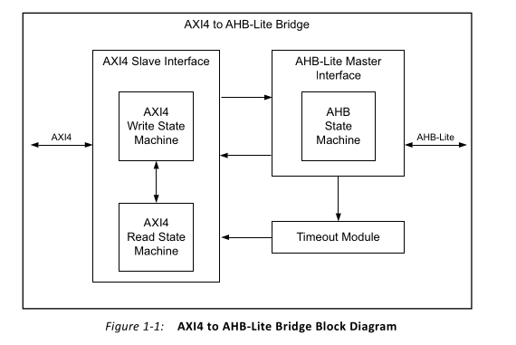

**1.  INTRODUCTION** 

Integrated circuits have entered the era of System-on-Chip (SoC), a design paradigm where all components of a computer or electronic system are integrated onto a single chip.  These  components  may  include  digital,  analog,  mixed-signal,  and  often radio-frequency  functionalities,  all  implemented  on  a  unified  substrate.  With  the increasing complexity of designs, Intellectual Property (IP) integration has become an indispensable aspect of SoC development. The widespread adoption of various IPs has significantly  influenced  the  design  flow,  making  On-Chip  Buses  (OCBs)  a  critical component of modern SoC architectures. 

Among  the  numerous  OCB  standards  available,  the  Advanced  Microcontroller  Bus Architecture  (AMBA)  has  emerged  as  the  industry  standard  for  SoC  interconnects. AMBA enables efficient development of multiprocessor designs with a large number of controllers and peripherals. Despite its name, AMBA’s applications extend far beyond microcontroller devices. Since its introduction by ARM in 1996, the architecture has been widely adopted across Application-Specific Integrated Circuits (ASICs) and SoC designs, including applications processors in portable mobile devices such as smartphones. The earliest  AMBA  specifications  introduced  the  Advanced  System  Bus  (ASB)  and  the Advanced  Peripheral  Bus  (APB),  laying  the  groundwork  for  a  commonly  used  and versatile bus architecture. 

In its latest iterations, such as AMBA 4.0, the architecture supports high-speed, pipelined data  transfers  through  an  extensive  set  of  bus  signals,  making  the  verification  of AMBA-based embedded systems a technically challenging task. 

This project focuses on verifying an AXI to AHB bridge, which provides an interface between  the  high-performance  AXI  bus  and  the  high-bandwidth  AHB  domain peripherals. The AMBA AXI (Advanced eXtensible Interface) to AHB-Lite (Advanced High-Performance Bus) bridge translates AXI4 transactions into AHB-Lite transactions. It includes a slave interface that receives transactions from the AXI4 master, converts them  into  AHB  transactions,  and  initiates  them  on the AHB bus, ensuring seamless communication between the two bus protocols. 

1. **AMBA AXI (Advanced eXtensible Interface)** 

The AMBA AXI protocol is designed for high-performance, high-frequency system architectures and incorporates features that make it well-suited for high-speed submicron interconnects. Its key features include: 

- **Separate  Address/Control  and  Data  Phases**:  Decoupling  address/control signaling from data transfer for enhanced efficiency. 
- **Support for Unaligned Data Transfers**: Facilitated by byte strobes, enabling flexible data handling. 
- **Burst-Based  Transactions**:  Transactions  are  initiated  with  a  single  start address, minimizing overhead. 
- **Independent Read and Write Channels**: Separate data channels optimize low-cost Direct Memory Access (DMA) operations. 
- **Multiple Outstanding Address Support**: Enhances throughput by enabling concurrent address transactions. 
- **Out-of-Order  Transaction  Completion**:  Allows  flexibility  in  completing transactions to optimize performance. 
- **Register Stage Integration**: Simplifies timing closure for complex designs. 

Additionally,  the  AXI  protocol  offers  optional  extensions  for  low-power  operation, enabling signaling to minimize energy consumption. 

The  AXI  protocol  operates  on  a  burst-based  transfer  model.  Each  transaction  is characterized by address and control information sent via the address channel, which defines  the  data  transfer's  parameters.  Data  exchange  between  the  master  and  slave occurs through five distinct channels: 

1. **Write Address Channel** 
1. **Write Data Channel** 
1. **Write Response Channel** 
1. **Read Address Channel** 
1. **Read Data Channel** 

For write transactions, where data flows from the master to the slave, the AXI protocol includes a dedicated write response channel. This channel allows the slave to confirm the completion  of  the  write  operation  to the master, ensuring robust communication and synchronization. 

2. **Advanced High-performance Bus (AHB)** 

AMBA AHB-Lite is specifically designed to meet the demands of high-performance, synthesizable designs. It is a bus interface that supports a single bus master, enabling high-bandwidth operations. The protocol incorporates distinct address and data phases, achieving pipelining by overlapping these phases to optimize throughput. 

AHB-Lite integrates features essential for high-performance and high-frequency systems, such as: 

- **Burst Transfers**: Facilitates efficient handling of sequential data. 
- **Single-Clock Edge Operation**: Simplifies timing and ensures consistency. 
- **Non-Tristate Implementation**: Improves reliability and simplifies design. 
- **Wide Data Bus Configurations**: Supports data widths of 64, 128, 256, 512, and 1024 bits, catering to diverse application requirements. 

The  AHB-Lite  architecture  is  highly  pipelined,  making  it  ideal  for  high-throughput operations.  Common  AHB-Lite  slaves  include  internal  memory  devices,  external memory interfaces, and high-bandwidth peripherals. While low-bandwidth peripherals can also function as AHB-Lite slaves, they are generally placed on the AMBA Advanced Peripheral  Bus  (APB)  to  optimize  system  performance.  Bridging  between  the high-performance AHB-Lite bus and the APB is achieved through an AHB-Lite slave component  known  as  an  APB  bridge.  This  bridge  enables  seamless  communication between the two bus protocols, ensuring system integration and efficiency. 

2. **AXI TO AHB BRIDGE** 

   The AMBA (Advanced Microcontroller Bus Architecture) AXI (Advanced eXtensible Interface)  to  AHB-Lite  (Advanced  High-Performance  Bus)  Bridge  facilitates  the translation of AXI4 transactions into AHB-Lite transactions. It features a slave interface that receives AXI4 master transactions, converts them into AHB master transactions, and initiates these transactions on the AHB bus. 

   The AXI protocol employs five distinct channels: the write address channel, write data channel, write response channel, read address channel, and read data channel. The AXI clock operates independently of the AHB clock, and the bridge effectively converts AXI read and write transactions into their corresponding AHB read and write transactions. This  bridge  serves  as  an  interface  between  high-performance  AXI  processors  and high-bandwidth  AHB  peripherals,  such  as  memory  controllers,  DMA  controllers, touchpads, and SD cards. 

   Data transfer in all AXI channels utilizes a handshake mechanism. The master asserts the  VALI D signal to indicate the availability of valid address, control, or data information, while the slave asserts the  READY signal when it is prepared to accept the information. 

   The  AHB  Bridge  buffers  address, control, and data signals from AXI4, drives AHB peripherals,  and  returns  data  and  response  signals  to  AXI4.  Address  decoding  is performed using an internal address map to select the appropriate peripheral. The bridge is designed to operate seamlessly when the AXI4 and AHB clocks have independent frequencies and phases. 

   For  every  AXI  channel,  invalid  commands  are  not  propagated.  Instead,  the  bridge generates error responses. For instance, if a peripheral being accessed does not exist, the bridge issues a  DECERR (decode error) response via the response channel (read or write). 

   If the target peripheral exists but asserts an error condition, the bridge returns a  SLVERR (slave error) response. 

   The Design Under Test (DUT) utilized for verification in this project is the LogiCORE IP AXI  to AHB-Lite Bridge (v1.00a) from Xilinx, which exemplifies robust design and compliance with the described protocols. 

3. **AXI TO AHB BRIDGE MicroArchitecture** 

   The  protocols  utilized  in  this  project  include  AXI4  and  AHB-Lite,  with  the IP generated in Vivado configured with the following parameters: a 32-bit data width, a 32-bit address width, a timeout value of 16, and the "**Enable Narrow Burst**" option activated. 

   

1. **AXI4 Slave Interface** 

The AXI4 slave interface module provides a bidirectional interface, offering flexibility in configuration. The AXI4 address width is configurable between 32 and 64 bits, while the data bus width can be set to either 32 or 64 bits. The AXI4 to AHB-Lite Bridge supports consistent data width across both interfaces, ensuring seamless integration and communication. 

When simultaneous read and write transfer requests occur on the AXI4 interface, the bridge prioritizes the read request over the write request, optimizing performance for scenarios requiring faster data retrieval. 

2. **AXI4 Write State** 

The AXI4 Write State Machine is an integral component of the AXI4 slave interface module,  operating  on  the  AXI4  write  channels.  This  module  manages  AXI4  write operations and generates corresponding write responses. In the event of a bridge timeout, it concludes the AXI4 write transaction by issuing a  SLVERR response. 

3. **AXI4 Read State Machine** 

The AXI4 Read State Machine is part of the AXI4 slave interface module, functioning on the AXI4 read channels. It governs AXI4 read operations and produces the appropriate read  responses.  Similar  to  the  write  state  machine,  if  a  bridge  timeout  occurs,  it terminates the AXI4 read transaction with a  SLVERR response. 

4. **AHB-Lite Master Interface** 

The AHB-Lite Master Interface module provides the interface for AHB-Lite operations. Configurable through the Vivado IDE, the AHB-Lite address width can range from 32 to 64 bits, while the data bus width can be either 32 or 64 bits. The AXI4 to AHB-Lite Bridge maintains uniform data widths across both the AXI4 and AHB-Lite interfaces, ensuring efficient data handling and compatibility. 

5. **AHB State Machine** 

The  AHB  State  Machine  resides  within  the  AHB-Lite  master  interface  module  and coordinates  data  transfers  between  the  AXI4  and  AHB-Lite  interfaces.  For  write operations initiated by the AXI4 interface, the state machine captures control signals and data from the AXI4 slave interface and transmits them as equivalent AHB-Lite write accesses.  Similarly,  it  conveys  AHB-Lite  write  responses  back  to  the  AXI4  slave interface. For read operations, it processes control signals from the AXI4 slave interface and facilitates equivalent AHB-Lite read accesses. The state machine also handles the transfer of AHB-Lite read data and read responses back to the AXI4 slave interface. 

6. **Timeout Module** 

The Timeout Module is designed to monitor and handle cases where the AHB-Lite slave does not respond to AHB transactions. It is parameterized to generate a timeout only if the configured parameter value is non-zero. When the AHB-Lite slave fails to respond, the module waits for a specified number of AXI4 clock cycles, as defined by the timeout parameter, before signaling a timeout. This mechanism ensures robust error handling and system reliability. 

4. **Features and Limitations of BRIDGE** 

   The Xilinx AXI to AHB-Lite Bridge is a soft IP core that facilitates the communication between AXI and AHB-Lite interfaces. The key features and limitations of the bridge are as follows: 

1. **Features of Bridge** 

**AXI4 Slave Interface:** 

- Compliant with the AXI4 specification. 
- Supports a 1:1 synchronous clock ratio between AXI and AHB interfaces. 
- Functions as a 32/64-bit slave interface on 32/64-bit AXI4 buses. 
- Supports incrementing burst transfers with lengths ranging from 1 to 256. 
- Supports wrapping burst transfers of lengths 2, 4, 8, and 16. 
- Handles fixed burst transfers with lengths ranging from 1 to 16. 
- Allows  narrow  transfers,  such  as  8/16-bit  transfers  on  a  32-bit  bus  and 8/16/32-bit transfers on a 64-bit data bus. 
- Provides limited support for cache encoding and protection units. 
- Includes address/data phase timeout management. 

**AHB-Lite Master Interface:** 

- Interfaces with the AHB-Lite bus as a 32/64-bit master on 32/64-bit AHB-Lite systems. 
- Supports single burst transfers. 
- Capable of handling wrapping burst transfers with lengths of 4, 8, and 16, as well as undefined burst lengths. 
- Does not issue incrementing burst transfers across 1 kB address boundaries. 
- Provides limited protection control. 
- Supports narrow transfers, including 8/16-bit transfers on a 32-bit data bus and 8/16/32-bit transfers on a 64-bit data bus 
2. **Limitations of the AXI to AHB-Lite Bridge AXI4 Slave Interface:** 
- Data bus widths greater than 64 bits are not supported. 
- The bridge does not implement registers due to the lack of support for posted writes. 
- Operations such as locked, barrier, trust zone, and exclusive are not supported. 
- Out-of-order completion of read and write transactions is not supported. 
- Unaligned and sparse transfers (i.e., transfers with gaps in strobes) are not supported. 
- Responses  like  EXOKAY  and  DECERR  are  not  supported  for  AXI4 transactions. 
- Low-power state functionality is not supported. 
- Secure access operations are not supported. 

**AHB-Lite Master Interface:** 

- Data bus widths greater than 64 bits are not supported. 
- Cacheable access is not supported. 
5. **Testbench Architecture **

**Testbench Architecture** 

1. **Sequences and Sequence Items** 

The  **AHB  Sequence  Item**  represents  the  fundamental  unit  of  AHB  protocol  transactions, encapsulating attributes like address, data, control signals, and transaction types (read/write). It uses  UVM  macros  for  automation,  introspection,  and  randomization  to  ensure  diverse  test scenarios.  Constraints  on  critical  signals  like  HREADY  guarantee protocol compliance while 

enabling robust verification. The **AHB Sequence**, extending  uvm\_s equence, generates and executes these transactions by using read and write operations. It verifies the DUT behavior by integrating randomized stimuli and response validation. 

The  **AXI  Sequence  Item**  is  a  modular  UVM  component  for  AXI4  protocol  verification, encapsulating  key  transaction  attributes  like  address,  burst  type,  and  operation  type.  Its randomization and constraints ensure protocol adherence, while utility methods like  aws i ze enhance  flexibility.  The  **axi\_rd\_addr\_sequence,  axi\_wr\_addr\_seq,  axi\_wr\_data\_seq, axi\_rd\_data\_seq, axi\_wr\_rsp\_seq** ,  built  on  uvm\_s equence,  uses  the  sequence  item  to generate AXI4 transactions, handling scenarios like varying burst lengths and aligned addresses. This  sequence  validates  the  AXI4 protocol's integrity and robustness by driving stimuli and capturing responses in a structured manner. 

2. **AHB AGENT** 

The  ahb\_agent . s v file defines the  ahb\_agent class, which integrates key components for the  AHB  verification  process,  including  the sequencer, driver, and monitor. The agent class inherits from  uvm\_agent and utilizes a configuration object to set up the environment. In the build  phase,  it  checks  the  configuration  and  creates  instances  of  the driver, sequencer, and monitor, if the agent is active. During the connect phase, it connects the driver’s sequence item port to the sequencer’s sequence item export. If the agent is inactive, it logs a message indicating the agent’s passive state. The file ensures the proper initialization and connection of components to enable AHB verification. 

3. **AXI AGENTS** 

The AXI agents consist of multiple agents, each designed to handle different aspects of the AXI protocol. The **Write Address Agent** and **Read Address Agent** manage the address phase of write and read transactions, respectively, while the **Write Data Agent** and **Read Data Agent** focus  on  the  data  phase  for  write  and read operations. Each agent is composed of its own sequencer, driver, and monitor, ensuring the correct generation of sequence items, driving of signals, and monitoring of transactions. Additionally, the **Write Response Agent** handles the response phase, verifying the correctness of write transactions. These agents work together to facilitate comprehensive AXI protocol verification, with each agent independently controlling its associated phase through dedicated components for sequencing, driving, and monitoring. 

4. **AHB ENVIRONMENT** 

The  ahb\_envi r onment  serves  as  the  environment  for  AHB-side  verification.  This  class manages the instantiation of the AHB agent and its connections within the testbench. In the build phase, the environment creates an instance of the  ahb\_agent , which is responsible for driving and  monitoring  the  AHB  protocol.  During  the  connect  phase,  the  environment  sets  up  the necessary connections, though the specific connections for analysis ports to the scoreboard are 

not detailed in this version. This class ensures proper integration and management of the AHB agent, playing a central role in the overall AHB verification process. 

5. **AXI ENVIRONMENT** 

The  axi \_envi r onment class, which serves as the environment for the AXI verification setup. This class is responsible for managing multiple AXI agents, including the Write Address, Read Address, Write Data, Read Data, and Write Response agents, each handling a specific phase of the AXI protocol. In the build phase, the environment creates instances of these agents, ensuring that all necessary components for AXI protocol verification are instantiated. During the connect phase,  the  environment  sets  up  the  connections  for  analysis  ports,  although  the  details  of connecting  these ports to the scoreboard are not included. This class plays a crucial role in managing the AXI agents and establishing the necessary connections to facilitate comprehensive AXI verification. 

6. **AXI-TO-AHB Environment** 

The  axi 2ahb\_env serves as the environment for AXI-to-AHB protocol verification. This class manages the AXI and AHB environments, the virtual sequencer, and the scoreboard. In the build phase, it creates instances of the AXI environment, AHB environment, virtual sequencer, and scoreboard. During the connect phase, it establishes the necessary connections between the virtual sequencer and the sequencers of the AXI and AHB agents, enabling coordinated transaction generation  across  the  two  protocols.  The  AXI  monitor  analysis  ports  are  connected  to  the scoreboard for transaction comparison, and the AHB monitor is similarly connected to ensure proper  verification.  This  environment  ensures  seamless  interaction  between  AXI  and  AHB components while facilitating the verification of data transfers between the two protocols. 

7. **TEST** 

The  axi 2ahb\_t es t  implements  the  testbench  for  verifying  the  AXI  to  AHB  bridge functionality.  The  test  class  axi 2ahb\_t es t  initializes  the  AXI-to-AHB  environment  and manages  the  execution  of  sequences  via  a  virtual  sequencer.  In  the  build  phase,  it  creates instances of the AXI2AHB environment, a virtual sequence, and configuration settings. The main phase of the testbench starts the sequence through the virtual sequencer, allowing the system to execute the test scenario. The test includes objections raised and dropped during the execution to manage the simulation flow. The file also provides for printing the topology at the end of the elaboration phase, ensuring the environment and sequence are set up correctly for the verification process. 

8. **TESTBENCH TOP** 

The  t b\_t op serves as the top module for running the AXI-to-AHB bridge verification testbench. It is responsible for generating the clock and reset signals for the DUT (Device Under Test), instantiating  the  DUT,  and  managing  the  connections  to  the AXI and AHB interfaces. The module  includes  initial  blocks  for  clock  and  reset  signal  generation. It also instantiates the  axi \_ahbl i t e\_br i dge\_0 DUT, connecting the AXI interface signals to the appropriate DUT ports and the AHB interface signals for the AHB-to-AXI bridge verification. The test execution is triggered by calling  r un\_t es t ( "axi 2ahb\_t es t ") in the UVM testbench. The module also sets up the UVM configuration database to link the AXI and AHB virtual interfaces with the respective interface instances and includes waveform dumping for simulation analysis. 

6. **DUT and AXI MASTER and AHB Slave Communication** 

The  diagram  illustrates  a  verification  environment  for  a  bridge  module  converting  AXI (Advanced  eXtensible  Interface)  transactions  to  AHB  (Advanced  High-performance  Bus) transactions.  The  left  section  features  the  AXI  domain,  where  AXI  sequences  generate transactions and interact with specialized drivers for different types of AXI operations. These drivers  include  the  Write  Address  Driver,  Write  Data  Driver,  Write Response Driver, Read Address Driver, and Read Data Driver. The drivers interface with the  axi \_i nt er f ace, which facilitates communication with the central AXI-to-AHB Bridge. The bridge plays a pivotal role in translating AXI protocol transactions into equivalent AHB protocol transactions. 

On the AHB domain side, the AHB driver handles the converted transactions and communicates with  the  ahb\_i nt er f ace. The driver interacts with AHB sequences, which drive specific transaction  scenarios  to  test  the  bridge's  functionality  comprehensively.  This  environment demonstrates  a  layered  and  modular  approach  to  protocol  verification,  ensuring  accurate translation between AXI and AHB. 

7. **How Does the Test Start and End?** 

   In the testbench top, the verification process starts by calling the  r un\_t es t method, where the name of the specific test to be executed is provided. This test contains the handles of all the AXI and AHB sequences needed for simulation. During the  mai n\_phas e of the test, the sequences are started on their respective sequencers based on the test scenario being executed. For example, in a write operation, the  phas e. r ai s e\_obj ect i on is used to signal the beginning of the test, ensuring the simulation does not terminate prematurely. The test executes multiple sequences concurrently in a fork-join block, such as starting the write address, write data, and write response sequences on their respective AXI agents while simultaneously executing the AHB sequence on the  AHB  agent.  Once  the  sequences  complete  or  a  specified  condition  is  met,  the phase.drop\_objection is called, marking the end of the test. 

   Similarly, in a read operation, the test initiates the appropriate sequences in a fork-join block, such  as starting the read address sequence, read data sequence, and the corresponding AHB sequence. Additionally, a specific mechanism monitors the progress of the read operation, such as counting the number of valid read responses ( RVALI D) on the AXI interface. This monitoring is implemented in a while loop within a forked thread, ensuring that the test waits for the expected number of read responses before concluding. Once the conditions are met or the forked processes complete, the test uses  phas e. dr op\_obj ect i on to signal the end of the simulation, allowing the  testbench  to  gracefully  exit.  This  structured  approach  ensures  that  both  write  and read operations are executed and validated comprehensively. 

10. **Directory Structure **

    The AXI2AHB\_Verification project is organized in a layered and modular directory structure to facilitate clarity, scalability, and efficient verification. At the root level, directories such as  docs ,  r es our ces ,  s i m, and  t b ensure separation of concerns and ease of navigation. The  docs directory houses documentation for the project, while  r es our ces contains reusable assets like scripts or utilities. The  s i m folder is designated for simulation results and related configurations. The core testbench resides in the  t b directory, encompassing key components like sequences, agents, and environment files. 

    Within the  t b directory, the testbench's building blocks are further subdivided. Sequences are managed in the  s eq\_l i b folder, with  bas e\_s eq serving as the foundational sequence. Agents, which drive or monitor protocol-specific transactions, are categorized under the  agent directory, with  dedicated  subdirectories  for  ahb\_agent  and  axi \_agent .  These  agents  are  further decomposed  into  specialized  modules  such  as  r d\_addr \_agent ,  wr \_addr \_agent ,  and  wr \_r s p\_agent ,  ensuring  precise  handling  of  AXI  and  AHB  protocol  operations.  The environment  ( env)  integrates  all  these  components  for  comprehensive  testing,  while  the include folder organizes common header files. Top-level modules like  test\_top and  top define and execute the test scenarios. 

11. **How to setup the project** 